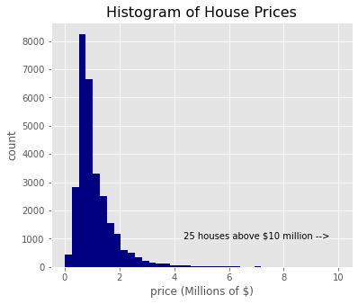

# KC-House-Sales-Phase-2-Project
Phase 2 Project for the Flatiron School Data Science Bootcamp

## Contents of Repository
student.ipynb: Jupyter notebook used to perform the analysis. 
king_county_house_sales.pdf: PDF of the non-technical presentation for stakeholders.  
visuals: Folder containing figures used in the presentation and README. 
data: The data used in the project and descriptions of the data. 

## Overview

## Business and Data Understanding
### Business Question:
What sort of renovations should somone selling a house in King County, WA make in order to increase their profit?

The data used in this project was made available to the public by King County itself. 
The data lists houses sold in King County, WA between June 10, 2021 and June 9, 2022. The raw data contains 30,155 house sales. 

For each house sale, there is information about the following:
1. Price. 
2. Square footage of living space, basement, lot, garage, and patio. 
3. Number of bedrooms, bathrooms, and floors. 
4. Condition. 
5. Grade. 
6. Whether the house is on a waterfront, near a greenbelt, has a nuisance, has a good view. 
7. Address and ZIP code. 
8. The year it was built and renovated. 

Some of the addresses and ZIP codes are incorrect, leading to many locations being listed outside of King County. These records as well as duplicates were removed. The final dataset contains 29,185 records.

A histogram of the prices is shown below.

The histogram is skewed towards lower prices with only a few very high price homes.

## Stakeholder Audience
The stakeholder is a real estate agency in King County, WA. They want to be able to assist people selling their homes to determine how to increase the price. This audience will not have a strong familiarity with statistical concepts, but they will have a strong understanding of the data that was used in the project. For example, they will know what the difference between the condition and the grade of a house and how realistic it is to improve those ratings.

## Modeling
I wanted to create a model that could produce a reasonable estimate for the price of a house given certain features of that house. I accomplished this by creating a linear regression model.

The model was built iteratively by first fitting features that were most strongly correlated with price. Other features were added to the model one at a time to see whether they improved the fit. Any features that were not included either did not improve the fit in a meaningful way, or they were strongly correlated to a feature that was already being included. For example, I used the square footage of living space in the model and did not include the square footage of above ground space or the number of bedrooms/bathrooms because I did not want multiple independent variables that essentially just represent how big the house is. Including redundant variables like this could lead to multicollinearity in the input data, leading to an unstable solution from the linear regression.

The model starts with a reference price, then

The table below describes the parameters in the model and the reference price.
| House Feature                 | Parameter Value and Meaning                            | Reference Price Assumes |
|:------------------------------|:-------------------------------------------------------|:------------------------|
|Square footage of living space | Increasing living space by 10% increases price by 4.3% | 1940 square feet        |
|Grade (ranges from 1 to 13)    | Increasing grade by 1 increases price by 12.2%         | 7                       |

The model can be thought of like this:
1. Start with a house with specific features (listed below). This house has a price of \$568,539.
2. Each parameter in the model corresponds to a factor that multiplies the reference price

The final model predicts price using the following features:
1. Square footage of living space. Reference house has 1940 square feet. 
2. Grade (Ranges from 1 to 13). Reference house has grade of 7 
3. Whether or not the house is on a waterfront. Reference house is not on a waterfront. 
4. Condition (5 levels). Reference house has Average condition. 
5. ZIP code. Reference house is located in 98042 (the ZIP code with the most sales). 
6. Whether the house was renovated. Reference house was not renovated. 

## Regression Results

## Conclusion
