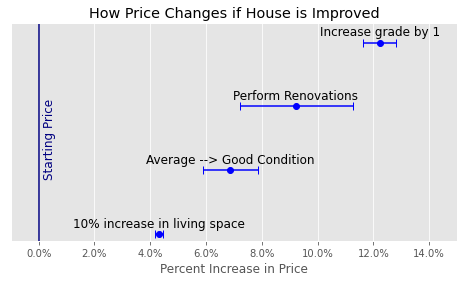

# KC-House-Sales-Phase-2-Project
Phase 2 Project for the Flatiron School Data Science Bootcamp

## Contents of Repository
|File/Folder                 | Description                                                    |
|:---------------------------|:---------------------------------------------------------------|
|student.ipynb               | Jupyter notebook used to perform the analysis.                 |
|king_county_house_sales.pdf | PDF of the non-technical presentation for stakeholders.        |
|visuals                     | Folder containing figures used in the presentation and README. |
|data                        | The data used in the project and descriptions of the data.     |

## Overview
In this project, I use data about house sales in King County, WA to determine what sort of renovations house sellers should make to raise the values of their homes. I accomplish this by creating a linear regression model that can be used to predict price based on the features and location of a house in King County.

## Business and Data Understanding
### Business Question:
What sort of renovations should somone selling a house in King County, WA make in order to increase their profit?

The data used in this project was made available to the public by King County itself. 
The data lists houses sold in King County, WA between June 10, 2021 and June 9, 2022. The raw data contains 30,155 house sales. 

For each house sale, there is information about the following:
1. Price. 
2. Square footage of living space, basement, lot, garage, and patio. 
3. Number of bedrooms, bathrooms, and floors. 
4. Condition. 
5. Grade. 
6. Whether the house is on a waterfront, near a greenbelt, has a nuisance, has a good view. 
7. Address and ZIP code. 
8. The year it was built and renovated. 

Some of the addresses and ZIP codes are incorrect, leading to many locations being listed outside of King County. These records as well as duplicates were removed. The final dataset contains 29,185 records.

A histogram of the prices is shown below. 

The histogram is skewed towards lower prices with only a few very high price homes.

## Stakeholder Audience
The stakeholder is a real estate agency in King County, WA. They want to be able to assist people selling their homes to determine how to increase the price. This audience will not have a strong familiarity with statistical concepts, but they will have a strong understanding of the data that was used in the project. For example, they will know what the difference between the condition and the grade of a house and how realistic it is to improve those ratings.

## Modeling
I wanted to create a model that could produce a reasonable estimate for the price of a house given certain features of that house. I accomplished this by creating a linear regression model.

Prior to creating a linear regression model, I first took the natural log of most of the continuous numerical data (such as price, square footage of living space, etc.) because the distribution of these were highly skewed to lower values. After taking a logarithm, their distributions were much more symmetric, which is more appropriate for creating the linear regression model. I also subtracted the median from most of the data. This is helpful because it will make the constant in the model more realistic and easier to interpret.

The model was built iteratively by first fitting features that were most strongly correlated with price. Other features were added to the model one at a time to see whether they improved the fit. Any features that were not included either did not improve the fit in a meaningful way, or they were strongly correlated to a feature that was already being included. For example, I used the square footage of living space in the model and did not include the square footage of above ground space or the number of bedrooms/bathrooms because I did not want multiple independent variables that essentially just represent how big the house is. Including redundant variables like this could lead to multicollinearity in the input data, leading to an unstable solution from the linear regression.

The success of the model was judged based on the adjusted R-squared value, the p-value of the F-statistic, and whether the parameters in the model were significant using a 0.05 significance level. Parameters that were not significant were not kept in the model.

## Regression Results
The easiest way to think about the model is to start with a reference house with certain conditions (listed in the third column or the table below). This house costs \$568,539 according to the model. Then, each parameter in the model tells you what to multiply this price by if something changes from the reference house (it gets more living space, improves its grade or condition, etc.).

The table below describes the parameters in the model and the reference price.
| House Feature                 | Parameter Value and Meaning                                   | Reference Price Assumes |
|:------------------------------|:--------------------------------------------------------------|:------------------------|
|Square footage of living space | Increasing living space by 10% increases price by 4.3%        | 1940 square feet        |
|Grade (ranges from 1 to 13)    | Increasing grade by 1 increases price by 12.2%                | 7                       |
|Whether house is on waterfront | House on waterfront will cost 61.5% more than one that is not | Not on a waterfront     |
|Condition (5 levels)           | House with a Very Good condition is worth 13.4% more than Average House with a Good condition is worth 6.9% more than Average House with a Fair condition is worth 4.7% less than Average House with a Poor condition is worth 5.8% less than Average | Average              |
|ZIP Code (74 ZIP codes)        | Each parameter compares price to houses in ZIP code 98042     | 98042                   |
|Whether house was renovated    | Renovating a house makes the price 9.2% larger                | Not renovated           |

The figure below summarizes the results for parameters that a seller might have the ability to change by performing renovations: 

The biggest change in price comes from increasing the grade of a house. However, this might be difficult to accomplish because the grade has to do with both the design and construction quality of the house. It seems easier to change the condition, which tends to have a smaller effect on the price.

This final model had an adjusted R-squared value of 0.685. This means that 68.5% of the variance in ln(price) was explained by the model.

The p-value of the F-statistic was effectively 0, showing that the model does capture the correlation between price and the features used in the fit.

Almost all of the parameters in the fit had p-values below 0.05. Below I describe the ones that did not:
1. The parameter comparing the price of Poor condition houses to Average condition houses had a p-value of 0.144. The other parameters related to the condition of the house were all statistically significant.
2. There were 73 parameters that compared houses in the 98042 ZIP code to other ZIP codes. Using a significance level of 0.05/73, 59 of these parameters were significant. The other 14 were not, but this just means that the houses in these ZIP codes had similar prices to those in 98042, all else being equal.

I tested the ability of the model to predict prices by creating a model using just 90% of the data, then using that model to predict prices for the other 10%. The results are shown in the graph below. 

Just over 75% of the predicted prices were within 25% of the actual price. There are still some houses for which the predicted prices are much lower or much higher than the actual price. This shows that there are features of these houses that are not captured by the model (and likely aren't present in the data used in this project).

## Recommendations
The goal of this project was to be able to recommend to sellers how they should renovate their homes prior to selling to help them make a greater profit. Whether or not they should perform specific renovations depends on how much those renovations are expected to raise the price and how much they will cost.

**Example**
A house is currently valued at $750,000. The seller could improve the house to increase the price. The new price given by the model is given in the table below for different types of improvements: 

| Improvement Made                          | New Price   |
|:------------------------------------------|:------------|
|Made renovations...                        | \$819,145   |
|and increased grade by 1                   | \$919,303   |
|and improved condition                     | \$875,381   |
|and increased grade AND improved condition | \$982,415   |

If the renovations are not expected to improve the grade or condition, then they must cost less than \$69,145 to be profitable. That number is higher if it is expected to improve the grade and/or condition.